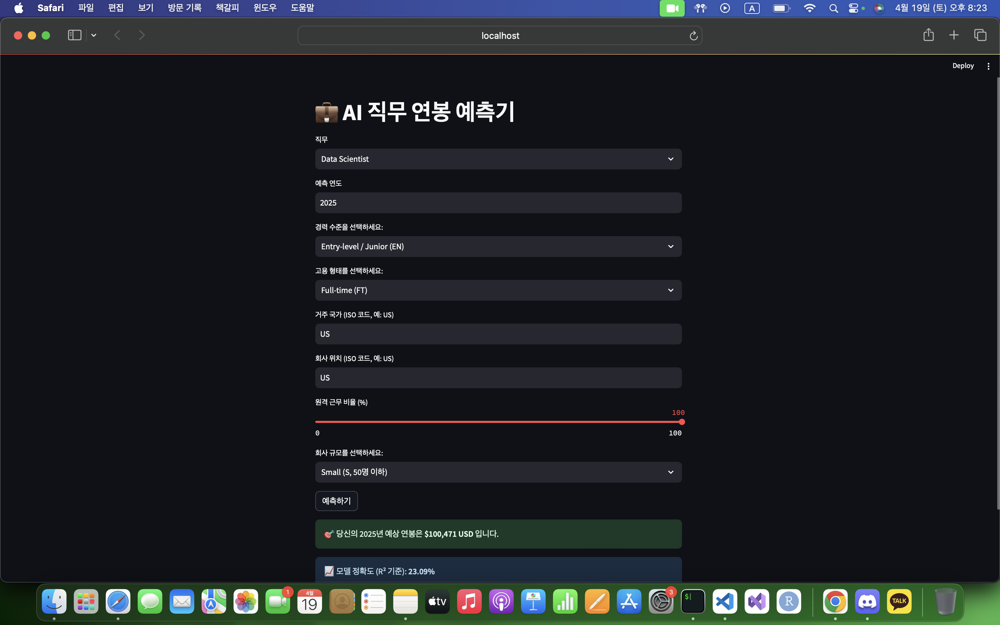

# 💵 About Project

이 프로젝트는 AI관련 직무의 미래 연봉을 예측하는 모델을 제작합니다.

# 🗂️ 모델 작동 순서 (`train_model.py`)
## 1. 데이터 불러오기
- `salaries.csv` 파일을 pandas를 통해 불러옴

## 2. 주요 직무만 필터링 (현재는 3개만 사용 중)
- 'Data Scientist', 'Machine Learning Engineer', 'AI Engineer' 직무만 선택
> ⚠️ TODO: 데이터에 포함된 더 많은 직무를 포함하여 정확도 개선 필요

## 3. 특성과 타겟 설정
- **입력 특성 (X)**:
  - work_year
  - experience_level
  - employment_type
  - job_title
  - employee_residence
  - remote_ratio
  - company_location
  - company_size  
- **타겟 (y)**:
  - salary_in_usd

## 4. 범주형 특성 인코딩
- `OneHotEncoder`를 사용하여 범주형 데이터 변환
- `ColumnTransformer`로 여러 열에 인코딩 적용

## 5. 데이터 분할
- 전체 데이터를 학습용(train)과 테스트용(test)으로 나눔
  - test_size=20%
  - random_state=42로 고정 (재현 가능성)

## 6. 인코딩 및 모델 학습
- 학습 데이터 인코딩 (`fit_transform`)
- 테스트 데이터 인코딩 (`transform`)
- `RandomForestRegressor` 모델 학습

## 7. 정확도 평가
- 예측값과 실제값 비교
- `R² score`로 모델 정확도 평가

## 8. 모델 및 결과 저장
- 학습된 모델, 인코더, R² 점수를 `.pkl` 파일로 저장
  - `model/model.pkl`
  - `model/encoder.pkl`
  - `model/r2_score.pkl`

## ✅ 출력 메시지
- 학습 및 저장 완료 메시지와 함께 R² 점수를 콘솔에 출력

# ⚙️Used
     
